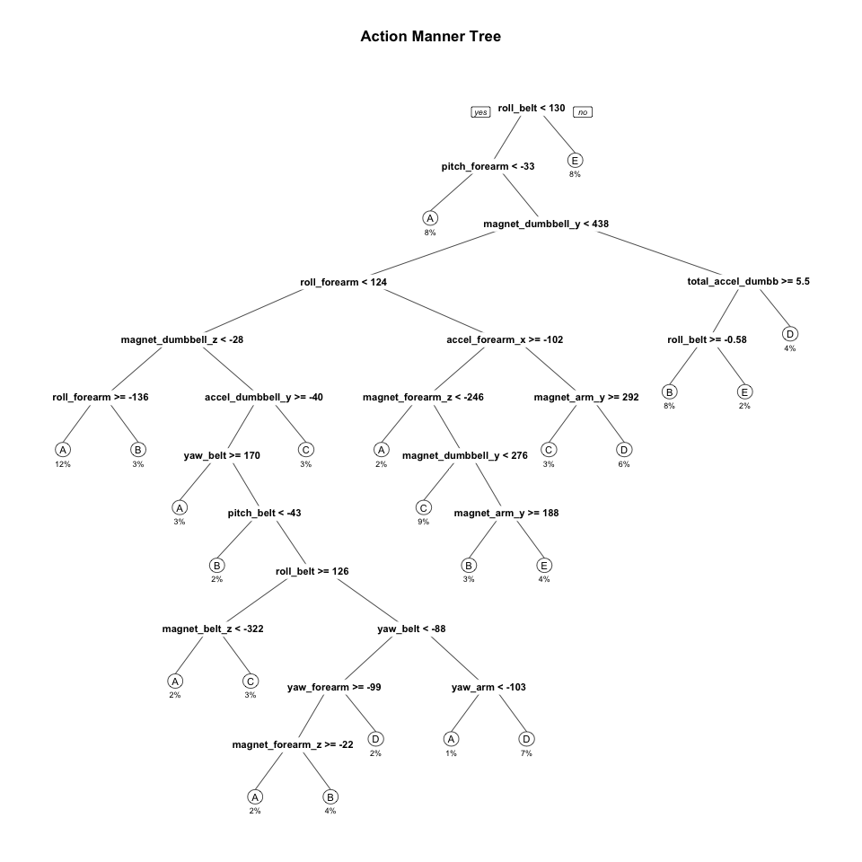
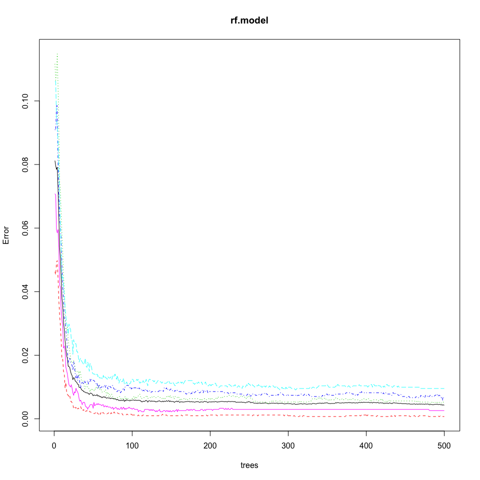

# ActivityPredictiveProject
FW  
2016/04/11  
## Introduction 
"Using devices such as *Jawbone Up*, *Nike FuelBand*, and *Fitbit* it is now possible to collect a large amount of data about personal activity relatively inexpensively. These type of devices are part of the quantified self movement, a group of enthusiasts who take measurements about themselves regularly to improve their health, to find patterns in their behavior, or because they are tech geeks. One thing that people regularly do is quantify how much of a particular activity they do, but they rarely quantify how well they do it. 

In this project, the goal will be to use data from accelerometers on the belt, forearm, arm, and dumbell of 6 participants. They were asked to perform barbell lifts correctly and incorrectly in 5 different ways. More information is available from the website here: [Data Link](http://groupware.les.inf.puc-rio.br/har) (see the section on the Weight Lifting Exercise Dataset)."

### Data Information 
The training and test data for this project are available here:

* [pml_training.csv](https://d396qusza40orc.cloudfront.net/predmachlearn/pml-training.csv)

* [pml_testing.csv](https://d396qusza40orc.cloudfront.net/predmachlearn/pml-testing.csv)

## Load Necessary Libraries 
In order to perform the machine learning model development and selection, the following libraries are needed: 

```r
library(caret)
```

```
## Loading required package: lattice
```

```
## Loading required package: ggplot2
```

```r
library(randomForest)
```

```
## randomForest 4.6-12
```

```
## Type rfNews() to see new features/changes/bug fixes.
```

```
## 
## Attaching package: 'randomForest'
```

```
## The following object is masked from 'package:ggplot2':
## 
##     margin
```

```r
library(MASS)
library(ggplot2)
library(rpart)
library(rpart.plot)
library(e1071)
```

## Load Data
Using the training data for model development and cross-validation, using testing for prediction, because testing dataset has no **classe**. First set the work directory to the place where the Rmd file is located. 

```r
url <- 'https://d396qusza40orc.cloudfront.net/predmachlearn/pml-training.csv'
destfile <- 'pml_training.csv'
if (!file.exists(destfile)) {
  download.file(url, destfile)
}
full.training <- read.csv(destfile, na.strings=c("NA","#DIV/0!",""), row.names=1)
dim(full.training)
```

```
## [1] 19622   159
```

```r
table(full.training$classe)  
```

```
## 
##    A    B    C    D    E 
## 5580 3797 3422 3216 3607
```

As we can see, the outcome **classe** has 5 classes: A, B, C, D, and E, which are from 19622 observations determined by different predictors, such as pitch belt, roll belt, magnet dumbbell, etc.. 

## Preprocessing Data
To ease the computation and due to the low informativity loss, the dataset is cleaned from the variables with an high share of NAs:

```r
full.training <- full.training[,7:dim(full.training)[2]]
training <- full.training[,colSums(is.na(full.training))==0]
dim(training)
```

```
## [1] 19622    53
```

This processing ends up with the **training** variable with 19622 observations and 53 predictors. 

## Build Model
Before doing any model development, the data is splited into two parts: *sub-training* and *sub-testing* with 75% as the partition rate, and the random seed is set as 333 for reproduciablity.


```r
set.seed(333)
inTrain <- createDataPartition(training$classe, p = 0.75, list=FALSE)
validation <- training[-inTrain,]
training <- training[inTrain, ]
dim(training)
```

```
## [1] 14718    53
```

*sub-testing* dataset will be used in cross-validation to calcuate the accuracy. 

According to the outcome and predictors, the problem is a classification problem, and decision tree and random forest algorithms are known for their ability of detecting the features that are important for classification, so first, the decision tree (**rpart** in R) has been used to do the modeling.

```r
rp.model <- rpart(classe ~., data=training, method='class')
rpart.plot(rp.model, main="Action Manner Tree", extra=100, under=TRUE, faclen=0,cex=0.7)
```



```r
pred0 <- predict(rp.model, validation, type='class')
confusionMatrix(pred0, validation$classe) 
```

```
## Confusion Matrix and Statistics
## 
##           Reference
## Prediction    A    B    C    D    E
##          A 1272  164    8   36   14
##          B   52  568  117   77  122
##          C   31  115  621   79   79
##          D   35   74   82  570   91
##          E    5   28   27   42  595
## 
## Overall Statistics
##                                           
##                Accuracy : 0.7394          
##                  95% CI : (0.7269, 0.7516)
##     No Information Rate : 0.2845          
##     P-Value [Acc > NIR] : < 2.2e-16       
##                                           
##                   Kappa : 0.6697          
##  Mcnemar's Test P-Value : < 2.2e-16       
## 
## Statistics by Class:
## 
##                      Class: A Class: B Class: C Class: D Class: E
## Sensitivity            0.9118   0.5985   0.7263   0.7090   0.6604
## Specificity            0.9367   0.9070   0.9249   0.9312   0.9745
## Pos Pred Value         0.8514   0.6068   0.6714   0.6690   0.8537
## Neg Pred Value         0.9639   0.9040   0.9412   0.9423   0.9273
## Prevalence             0.2845   0.1935   0.1743   0.1639   0.1837
## Detection Rate         0.2594   0.1158   0.1266   0.1162   0.1213
## Detection Prevalence   0.3046   0.1909   0.1886   0.1737   0.1421
## Balanced Accuracy      0.9243   0.7527   0.8256   0.8201   0.8174
```

```r
rp.error <- 1-sum(pred0==validation$classe)/length(pred0)  
print(rp.error)
```

```
## [1] 0.2606036
```

Secondly, we can also use random forest model along with training data

```r
rf.model <- randomForest(classe ~., data=training, method='class')
plot(rf.model)
```



```r
# cross-validation and plot
pred1 <- predict(rf.model, validation)
confusionMatrix(pred1, validation$classe)    
```

```
## Confusion Matrix and Statistics
## 
##           Reference
## Prediction    A    B    C    D    E
##          A 1395    4    0    0    0
##          B    0  942    2    0    0
##          C    0    3  853    5    2
##          D    0    0    0  799    2
##          E    0    0    0    0  897
## 
## Overall Statistics
##                                           
##                Accuracy : 0.9963          
##                  95% CI : (0.9942, 0.9978)
##     No Information Rate : 0.2845          
##     P-Value [Acc > NIR] : < 2.2e-16       
##                                           
##                   Kappa : 0.9954          
##  Mcnemar's Test P-Value : NA              
## 
## Statistics by Class:
## 
##                      Class: A Class: B Class: C Class: D Class: E
## Sensitivity            1.0000   0.9926   0.9977   0.9938   0.9956
## Specificity            0.9989   0.9995   0.9975   0.9995   1.0000
## Pos Pred Value         0.9971   0.9979   0.9884   0.9975   1.0000
## Neg Pred Value         1.0000   0.9982   0.9995   0.9988   0.9990
## Prevalence             0.2845   0.1935   0.1743   0.1639   0.1837
## Detection Rate         0.2845   0.1921   0.1739   0.1629   0.1829
## Detection Prevalence   0.2853   0.1925   0.1760   0.1633   0.1829
## Balanced Accuracy      0.9994   0.9961   0.9976   0.9966   0.9978
```

```r
rf.error <- 1-sum(pred1==validation$classe)/length(pred1)
print(rf.error)
```

```
## [1] 0.003670473
```

As expected, random forest algorithm performed better than Decision Trees, and from the tree number vs error, we can see after using 100 or more trees, the error doesn't change that much, this may help to reduce the computing time while keeping the model accuracy.

## Prediction/Forecasting
From the analysis above, accuracy for Random Forest model was 0.996 (95% CI: (0.994, 0.998)) compared to 0.739 (95% CI: (0.727, 0.752)) for Decision Tree model. The random Forest model is choosen. The accuracy of the model is 0.996. The expected out-of-sample error is estimated at 1-0.996=0.004, or 0.4%. The test data set comprises 20 cases. With an accuracy above 99% on the cross-validation data, we can expect that very few, or none, of the test samples will be missclassified. Therefore, the **random forest model** is used for predicting the action manner (5 classes).


```r
url <- 'https://d396qusza40orc.cloudfront.net/predmachlearn/pml-testing.csv'
destfile <- 'pml_testing.csv'
if (!file.exists(destfile)) {
  download.file(url, destfile)
}
testing = read.csv(destfile,na.strings=c("NA","#DIV/0!",""))

# apply same selection as training data
testing <- testing[,7:dim(testing)[2]]
testing <- testing[,colSums(is.na(testing))==0]
dim(testing)
```

```
## [1] 20 54
```

```r
ptest <- predict(rf.model, testing, type='class')   # write out ptest for submission or display the values of the prediction
print(ptest)
```

```
##  1  2  3  4  5  6  7  8  9 10 11 12 13 14 15 16 17 18 19 20 
##  B  A  B  A  A  E  D  B  A  A  B  C  B  A  E  E  A  B  B  B 
## Levels: A B C D E
```
