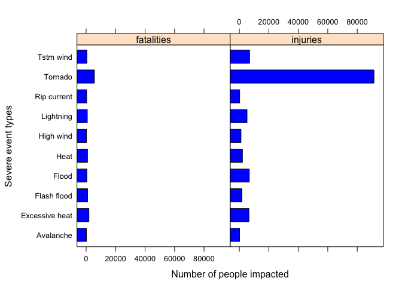
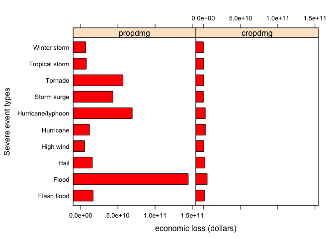

# The impacts of severe weather events on human life and economy

## Synopsis
This report downloads data from NOAA Storm Database and performs a statistical analysis on the impact of severa weather events to human life and economy.

Based on the results, we can see that most of the physical phenomena caused injuries to people, some of which could cause fatalities as well. According to the analysis, Tornadoes are the most damaging events, caused ~100,000 casualties in the last 60 years.

When analysing the impact of the severe events on the economy, we found that most of severe event types can cause property damages and crop damages is relatively smaller. We observe that floods caused $15 billions losses in terms of damages in the last 60 years, mostly on properties.

From the overall analysis, those severe weather events can cause both casualties and economic losses and preventing such impacts is an important by preparation and forecasting.

## Data Process
The data for this project can be downloaded from: Dataset: [Storm Data](https://d396qusza40orc.cloudfront.net/repdata%2Fdata%2FStormData.csv.bz2) [47Mb]

The data is from the U.S. National Oceanic and Atmospheric Administration's (NOAA) storm database. This database tracks characteristics of major storms and weather events in the United States, including when and where they occur, as well as estimates of any fatalities, injuries, and property damage.

There is also some documentation of the database available. Here you will find how some of the variables are constructed/defined.

* National Weather Service [Storm Data Documentation](https://d396qusza40orc.cloudfront.net/repdata%2Fpeer2_doc%2Fpd01016005curr.pdf)
* National Climatic Data Center Storm Events [FAQ](https://d396qusza40orc.cloudfront.net/repdata%2Fpeer2_doc%2FNCDC%20Storm%20Events-FAQ%20Page.pdf)

The events in the database start in the year 1950 and end in November 2011. In the earlier years of the database there are generally fewer events recorded, most likely due to a lack of good records. More recent years should be considered more complete.

### Load
Data are downloaded and imported in inData data frame. This step takes time because the dataset is pretty big. Be patient.

```r
setwd('/Users/fengw/study/datasciencecoursera/ReproducibleResearch/courseProject2')
infile <- "StormData.csv"
inData <- read.csv(infile)
head(inData,2)
```

```
##   STATE__          BGN_DATE BGN_TIME TIME_ZONE COUNTY COUNTYNAME STATE
## 1       1 4/18/1950 0:00:00     0130       CST     97     MOBILE    AL
## 2       1 4/18/1950 0:00:00     0145       CST      3    BALDWIN    AL
##    EVTYPE BGN_RANGE BGN_AZI BGN_LOCATI END_DATE END_TIME COUNTY_END
## 1 TORNADO         0                                               0
## 2 TORNADO         0                                               0
##   COUNTYENDN END_RANGE END_AZI END_LOCATI LENGTH WIDTH F MAG FATALITIES
## 1         NA         0                        14   100 3   0          0
## 2         NA         0                         2   150 2   0          0
##   INJURIES PROPDMG PROPDMGEXP CROPDMG CROPDMGEXP WFO STATEOFFIC ZONENAMES
## 1       15    25.0          K       0                                    
## 2        0     2.5          K       0                                    
##   LATITUDE LONGITUDE LATITUDE_E LONGITUDE_ REMARKS REFNUM
## 1     3040      8812       3051       8806              1
## 2     3042      8755          0          0              2
```
### Process 
As seen from the first two lines of the data set, there are some fields are useful and some are not. In order to focus on useful/related information, a simpler data frame **slimData** is generated and all analysis is based on it.

To calculate the human injuries and fatality, a data frame called **casualties** is generated which has both the aggregated fatal and non-fatal injuries.

The economic impact is assessed by calculating the exponential value of the property and corp damage in data frame **economicLoss**.

Using **melt** function from package **reshape2**, two smaller data frames for both **casualties** and **economicLoss** are generated to just involve the top 10 events that cause most human fatal and injuries and most economic losses, respectively. 

The packages: **Hmisc** and **car** are used for changing the event name and recode the loss units in the dataset, which need to be installed ahead.


```r
library(Hmisc)
```

```
## Loading required package: lattice
```

```
## Loading required package: survival
```

```
## Loading required package: Formula
```

```
## Loading required package: ggplot2
```

```
## 
## Attaching package: 'Hmisc'
```

```
## The following objects are masked from 'package:base':
## 
##     format.pval, round.POSIXt, trunc.POSIXt, units
```

```r
library(reshape2)
library(car)
library(lattice)

inData$EVTYPE <- capitalize(tolower(inData$EVTYPE))

# reduce the size of the data frame 
slimData <- data.frame(eventType=inData$EVTYPE,
                       fatalities=inData$FATALITIES,injuries=inData$INJURIES, 
                       propdmg=inData$PROPDMG, propdmgexp=inData$PROPDMGEXP, 
                       cropdmg=inData$CROPDMG, cropdmgexp=inData$CROPDMGEXP) 

casualties <- aggregate(cbind(fatalities, injuries) ~ eventType, slimData, sum)
cas <- melt(head(casualties[order(-casualties$fatalities, -casualties$injuries), ], 10))
```

```
## Using eventType as id variables
```

```r
names(cas) = c("eventType","casualtiesType","numCasualties")

lossUnit <- as.numeric(Recode(slimData$propdmgexp,"'0'=1;'1'=10;'2'=100;'3'=1000;'4'=10000;'5'=100000;'6'=1000000;'7'=10000000;'8'=100000000;'B'=1000000000;'h'=100;'H'=100;'K'=1000;'m'=1000000;'M'=1000000;'-'=0;'?'=0;'+'=0", as.factor.result = FALSE))
slimData$propdmg <- slimData$propdmg * lossUnit 

cropLossUnit <- as.numeric(Recode(slimData$cropdmgexp,"'0'=1;'2'=100;'B'=1000000000;'k'=1000;'K'=1000;'m'=1000000;'M'=1000000;''=0;'?'=0", as.factor.result = FALSE))
slimData$cropdmg <- slimData$cropdmg * cropLossUnit

economicLoss <- aggregate(cbind(propdmg, cropdmg) ~ eventType, slimData, sum)
eco <- melt(head(economicLoss[order(-economicLoss$propdmg, -economicLoss$cropdmg), ], 10))
```

```
## Using eventType as id variables
```

```r
names(eco) = c("eventType","lossType","losses")
```

## Results
Using **barchart** function in lattice package for plotting and interpreting the result to answer the questions: 
* Question 1: Across the United States, which types of events (as indicated in the EVTYPE variable) are most harmful with respect to population health?

* Question 2: Across the United States, which types of events have the greatest economic consequences?

### Human casualties

```r
barchart(eventType ~ numCasualties | casualtiesType, data=cas, col='blue',
         xlab = "Number of people impacted", ylab = "Severe event types")
```



According to the flipped barplot graph of the fatal (Deaths) and non-fatal injuries by event type, we can see that Tornado is the most harmful event type with respect to human life, which answered the first question. 

### Economic impacts

```r
barchart(eventType ~ losses | lossType, data=eco, col='red',
         xlab = "economic loss (dollars)", ylab = "Severe event types")
```



According to the flipped barplot graph of the property damage and crop damage (in dollars) by event type, we can see that Floods have the greatest economic consequences, causing losses in property and crop, which answered the second question.
